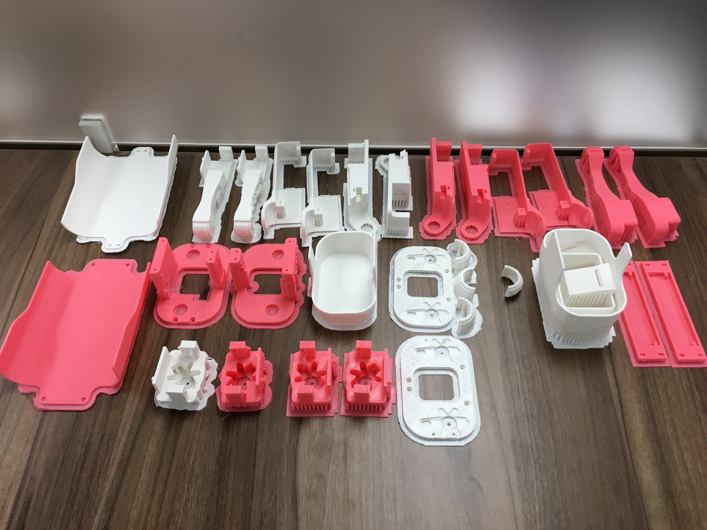

# SpotmicroaiT 的 3d 打印

## 打印部件

**以下文件打印 2 份：**

- 脚（左右貌似是一样的）

V1.02_Foot.stl

V1.02_Foot(Mirror).stl

- 左侧的腿（包含了四个部分）

V1.02_Left_Hind_Limb.stl
V1.02_Left_MidLimb_Cover.stl
V1.02_Left_MidLimb.stl
V1.02_Left_Wrist.stl

- 右侧的腿

V1.02_Right_Hind_Limb.stl

V1.02_Right_MidLimb_Cover.stl

V1.02_Right_MidLimb.stl

V1.02_Right_Wrist.stl

**以下文件打印 1 份：**

- 身体中间的平台，用于放置电池，树莓派等设备

V1.02_Chassis_BasePlate_RPi4.STL

- 平台两侧的挡板

V1.02_Chassis_Left_Side.stl

V1.02_Chassis_Right_Side.stl

- 身体上下部分

V1.02_Cover_Top.stl

V1.02_Cover_Bottom.stl

- 头：

V1.02_Cover_Nose.stl

- 屁股：（2种类：有LCD显示屏的位置/没有）

V1.02_Cover_Rear_Plain.stl
V1.02_Cover_Rear.stl

- 四个肩膀

V1.02_Front_Inner_Shoulder.stl

V1.02_Front_Outer_Shoulder.stl

V1.02_Rear_Inner_Shoulder.stl

V1.02_Rear_Outer_Shoulder.stl

## 价格

如果自己有 3d 打印机，那整个打印下来的用料估计在 1～1.5 卷线材，一卷线材的价格大约 90～100 元，成本还是比较低的。
如果是在网上下单，优点是速度比较快，而且专业做 3d 打印的最后成品的效果会比较好，但是相应的，成本比较高，估计不同的商家，选用不同的材料要 400～800 元之间的花费。

## 时间
自己打印一个部件，比如像 V1.02_Right_MidLimb 这种中等大小，中等复杂程度的，选择最低的打印精度，需要 3 小时左右的时间，所以 24 小时不停打印，也需要超过 3 天的时间。
所以在没有出错的情况下，一般也需要一周的时间才能把全套的配件打印齐全。
如果是自己打印，同时之前没有 3d 打印的经验积累，那打废掉是非常常见的，打印周期还要进一步拉长。
另外，如果想要更好的精度，那打印时间会成倍增长。

## 实际操作
由于这段时间在学校，可以借用设备，所以体验了一把自己进行 3d 打印所有配件。
使用的设备如下：
**闪铸科技 Dreamer 梦想家**

官方的配置介绍如下：

> 打印规格
>
> 产品类型 3D打印机
>
> 成型原理 熔丝制造法FFF
>
> 成型平台尺寸 230×150×140mm
>
> 定位精度 Z轴：0.0025mm，XY轴：0.011mm
>
> 打印精度 ±0.1mm
>
> 打印层厚 0.05-0.5mm
>
> 打印喷头 双喷头
>
> 喷嘴直径 0.4mm
>
> 喷头流速 24cc/小时
>
> 打印速度 30-200mm/s
>
> 软件要求
>
> 随机软件 Flashprint，兼容simplify3D 3.0版本(直接使用），Slic3r，Skeinforge，Cura（需设置）
>
> 打印数据格式 输入：3MF，STL，OBJ，FPP，BMP，PNG，JPG，JPEG
>
> 输出：GX，G
>
> 操作系统 Windows xp/Vista/7，Linux，Mac OX
>
> 耗材规格
>
> 打印材料 ABS，PLA，TPU，PETG，可溶性耗材，柔性耗材，导电耗材
>
> 耗材直径 1.75±0.07mm
>
> 材料颜色 多种颜色可选
>
> 物理参数
>
> 喷头工作温度 240℃
>
> 工作环境 15-30℃
>
> 电源要求 AC 100-240V
>
> 其它参数
>
> 控制面板 3.5英寸全彩触摸屏
>
> 支撑功能 支持
>
> 连接方式 USB，SD卡，WIFI
>
> 产品材质 塑料合金机身
>
> 产品颜色 白色
>
> 产品尺寸 48×34.4×38.2cm
>
> 产品重量 10.7kg
>
> 其它参数 打托体积：84×115×115mm
>
>  
>
> 产品特性
>
> 产品特性1 塑料合金机身，结构稳定、打印精度高，适合教学应用
>
> 全封闭设计，内置温控系统，适应不同耗材的温控需求
>
>  
>
> 产品特性2 产品通过CE，FCC，RoSH认证
>
> 软硬件全套自主知识产权，拥有机身设计外观专利证书和软件著作权证书
>
>  
>
> 产品特性3 首创耗材内置设计，确保耗材品质持久稳定
>
> 6.5mm合金加热平台，成型效果好，永不变形
>
> 稳定双喷头结构，支持双色及多种耗材打印纠错
>
>  
>
> 产品特性4 机身内置４Ｇ闪存支持WIFI、手机客户端连接及SD卡直接打印
>
> 支持１６国语言操作，傻瓜化操作无学习门槛；
>
> 支持耗材类型：ABS/PLA/HIPS/PVA/软性耗材
>
>  
>
> 产品特性5 切片软件为国产软件，具有软件著作权证书
>
> 自动生成支撑功能，提供2种自动支撑方案

## 打印成果

自己打印出来就比较粗糙，而且有不少尴尬的问题。  

由于学校只有PLA打印材料，所以只能用 PLA 作为支撑。  

我想原因在于专门作为支撑的水溶性材料比较贵，所以学校没有采购，在京东和淘宝上随便搜一下，基本都要 900元/0.75kg 左右。  

而普通的 PLA 线材 1kg 一卷，只要 100 元左右。  

不用专用支撑材料的结果就是，去除支撑将是一个费时费力的痛苦过程～～～

- **为什么需要支撑呢？**

因为我们无法建造空中楼阁，3d 打印必须是一层一层往上进行的，所以对于一些悬空的结构，那下面必须有支撑才行！

- **建议：**

如果你也很不幸，像我一样必须用 PLA 材料做支撑  

那么在打印的选项里面，尽量选择 `柱状支撑`  

然后备好一把 `尖嘴钳` 用于去除支撑  

- **视频解析：**

（待更新）

- **References**