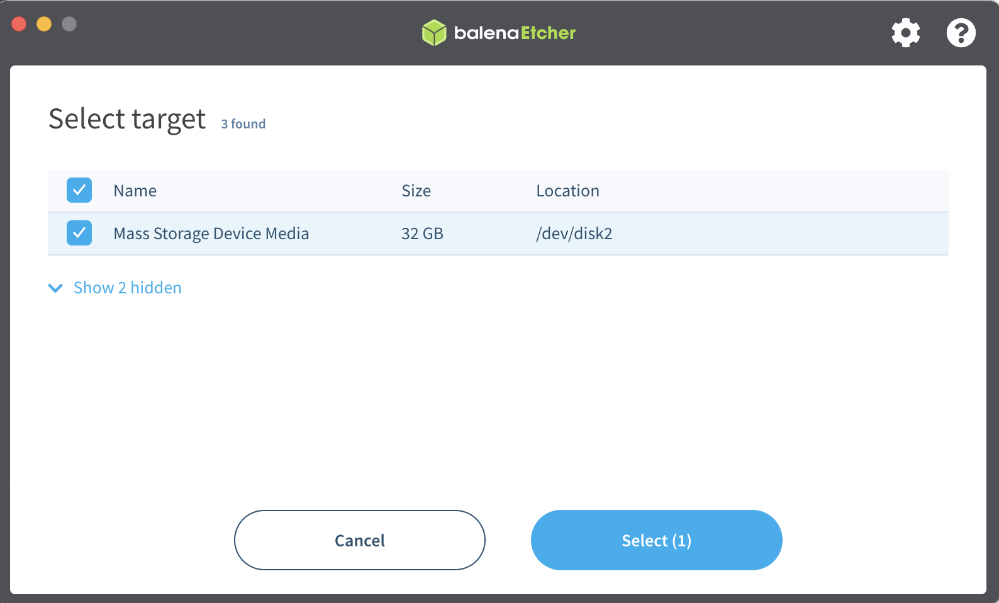

# Raspberry 系统安装

## 1. 下载安装包  
  
2020-02-10-ubiquity-xenial-lxde-raspberry-pi.img.xz  
  
网上查了一下，这个操作系统并不是官方操作系统，但是应该比较适合搭建机器人，便于使用 ROS  
  
该系统基于 Ubuntu 16.04 搭建

## 2. 烧录镜像

烧录之前，使用 SD Card Formatter 进行 SD 卡的格式化  

  

  

  
如果是 Windows 系统，可以使用 Win32DiskImager 进行烧录，使用 .img 后缀的镜像文件  
  
使用 macOS 系统，可以下载 balenaEtcher 进行烧录 .xz 镜像  
  
  

  

  

  

  

  

  

  

  

  

准备好键盘，鼠标，显示器！  
  

  